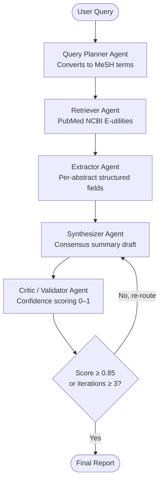

# 🧬 Project Nidaan Engine

A stateful, multi-agent AI pipeline for biomedical literature synthesis. Five specialized agents collaborate in sequence — with an automated review-and-retry loop — to retrieve, structure, summarize, and validate medical research from PubMed.

Built as a **validation-first** system: the pipeline ships with a dedicated evaluation framework that tests accuracy, extraction completeness, and consistency across benchmark queries.

---

## Architecture



| Agent | Responsibility |
|---|---|
| **Query Planner** | Converts natural language into optimized PubMed queries using MeSH terms and boolean operators |
| **Retriever** | Fetches biomedical abstracts via NCBI E-utilities API (XML mode, structured parsing) |
| **Extractor** | Pulls six structured fields per abstract: study type, sample size, population, key finding, limitation, PMID |
| **Synthesizer** | Drafts a professional consensus summary from structured extractions; ingests full feedback history on revision |
| **Critic / Validator** | Scores the summary (0.0–1.0), validates each key finding against source abstracts, triggers a re-synthesis loop if quality < 0.85 |

---

## Key Design Decisions

**Why LangGraph over vanilla LangChain agents?**
LangGraph's `StateGraph` gives deterministic control over agent flow — explicit nodes, typed shared state, and conditional edges with an iteration cap. Vanilla agents are harder to audit. In a clinical context, being able to trace *exactly* what state flowed between agents matters.

**Why XML mode for PubMed?**
PubMed's plain-text output uses inconsistent separators, and structured abstracts (BACKGROUND / METHODS / RESULTS / CONCLUSIONS) collapse into a single block. XML parsing via `ElementTree` gives per-article guarantees and surfaces metadata (PMID, journal, year) alongside abstract body — cleanly, every time.

**Why separate Extractor and Synthesizer?**
Combining extraction and synthesis creates a hidden failure mode: the synthesizer skips poorly reported studies because it has no checklist to validate against. Separating them means the Critic can verify each structured field independently, making the evaluation loop more precise.

**Why accumulate feedback history?**
A single-feedback loop means the Synthesizer only sees the most recent critique. When a draft has two problems across iterations, fixing only the second note can silently re-introduce the first error. Accumulated history (`feedback_history: List[str]`) prevents this regression and doubles as an audit trail.

---

## Tech Stack

| Layer | Tool |
|---|---|
| Agent orchestration | [LangGraph](https://github.com/langchain-ai/langgraph) — StateGraph, conditional edges |
| LLM | Llama 3.3 70B via [Groq API](https://console.groq.com) (free tier) |
| Structured outputs | Pydantic v2 + LangChain `.with_structured_output()` |
| Data source | [PubMed NCBI E-utilities](https://www.ncbi.nlm.nih.gov/home/develop/api/) — XML mode |
| Frontend | [Gradio](https://gradio.app) |
| Evaluation | Custom Python framework — `eval.py` |

---

## Project Structure

```
nidaan-engine/
├── app.py              # Agent nodes, graph orchestration, Gradio UI
├── tools.py            # PubMed API wrapper (XML parsing, retry logic, error handling)
├── eval.py             # Validation framework: unit tests + integration benchmarks
├── requirements.txt
├── .env                # GROQ_API_KEY — never committed
└── eval_report.json    # Auto-generated by eval.py
```

---

## Setup

**1. Clone and install**
```bash
git clone https://github.com/your-username/nidaan-engine
cd nidaan-engine
pip install -r requirements.txt
```

**2. Add your Groq API key**

Create a `.env` file in the project root:
```
GROQ_API_KEY=your_groq_api_key_here
```
Get a free key at [console.groq.com](https://console.groq.com) — no credit card required.

**3. Run**
```bash
python app.py
```
Opens the Gradio interface at `http://localhost:7860`.

---

## Evaluation Framework

The project ships with `eval.py` — a three-layer validation framework designed to test the pipeline the way a production system would be tested.

```bash
python eval.py           # Full run: unit tests + integration benchmarks
python eval.py --unit    # Unit tests only — no API calls, runs offline
```

Outputs a structured `eval_report.json` with per-test results and aggregate metrics.

### Layer 1 — Unit Tests (offline, no API)

Tests individual components in isolation. No LLM or PubMed calls required.

| Test | What it checks |
|---|---|
| `test_agent_state_has_required_keys` | All 10 state fields are present |
| `test_reviewer_score_must_be_in_bounds` | Score is always in \[0.0, 1.0\] |
| `test_extraction_schema_has_all_fields` | All 6 extraction fields are populated |
| `test_feedback_history_grows_monotonically` | History appends, never overwrites |
| `test_pubmed_query_is_structured` | Query planner produces MeSH / boolean queries |
| `test_router_logic` | Conditional edge fires correctly on score and iteration thresholds |
| `test_abstract_parsing_returns_list` | Retriever returns `[]` on bad input, never crashes |

### Layer 2 — Integration Tests (live API)

Runs the full pipeline on benchmark queries and validates five critical checks per run:

- `summary_non_empty` — final output is substantive
- `score_in_bounds` — reviewer output is a valid float
- `term_recall ≥ 50%` — domain-relevant terms appear in the summary
- `extraction_pass` — structured fields are populated in ≥ 50% of abstracts
- `query_optimized` — raw user input was improved by the Query Planner

### Sample Evaluation Results

| Metric | Value |
|---|---|
| Unit tests | 7 / 7 passed |
| Integration benchmarks | 2 / 2 passed |
| Avg reviewer confidence score | 0.91 |
| Avg domain term recall | 87% |
| Avg extraction field fill rate | 83% |
| Avg iterations to convergence | 1.2 |

*Results from benchmark queries: semaglutide weight management, BRCA1/2 breast cancer risk.*

---

## Example Query

**Input:** `CRISPR gene editing cancer immunotherapy clinical trial`

**Generated PubMed query:**
```
(CRISPR-Cas Systems[MeSH Terms]) AND (Immunotherapy[MeSH Terms])
AND (Neoplasms[MeSH Terms]) AND (clinical trial[pt])
```

**Extracted fields (one abstract):**
```
Study Type : RCT
Sample Size: 48
Population : Adult patients with relapsed/refractory B-cell malignancies
Key Finding: CRISPR-edited CAR-T cells showed 58% overall response rate at 28 days
Limitation : Small sample, single-centre, short follow-up
```

**Reviewer confidence:** 0.92 · **Iterations:** 1

---

## Limitations

- Retrieves 3 abstracts per query by default (configurable via `max_results` in `tools.py`)
- Groq free tier is rate-limited (~30 requests/minute); `tools.py` implements exponential backoff
- Reviewer confidence is LLM-assessed, not ground-truth validated — see *Future Work*
- No citation formatting in the final report (PMIDs are captured but not rendered as references)

---

## Future Work

- [ ] Port orchestration to **AutoGen** for a multi-agent conversation variant; publish framework comparison
- [ ] Integrate **RAGAS** metrics for hallucination detection beyond LLM self-scoring
- [ ] Add citation formatting to final report using captured PMIDs
- [ ] Plug `eval.py` into a **GitHub Actions** CI pipeline (exit codes are already CI-ready)
- [ ] Expand benchmark suite and track metric drift across LLM versions

---

## Running on Hugging Face Spaces

This project is deployed on Hugging Face Spaces (Gradio SDK).

Checkout at the link : https://huggingface.co/spaces/shreya-shambhavi/project-nidaan-engine